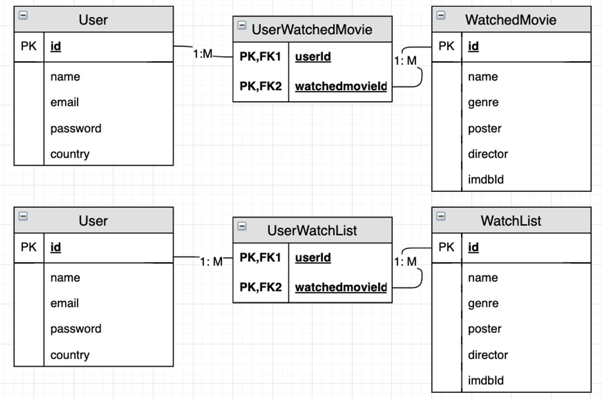
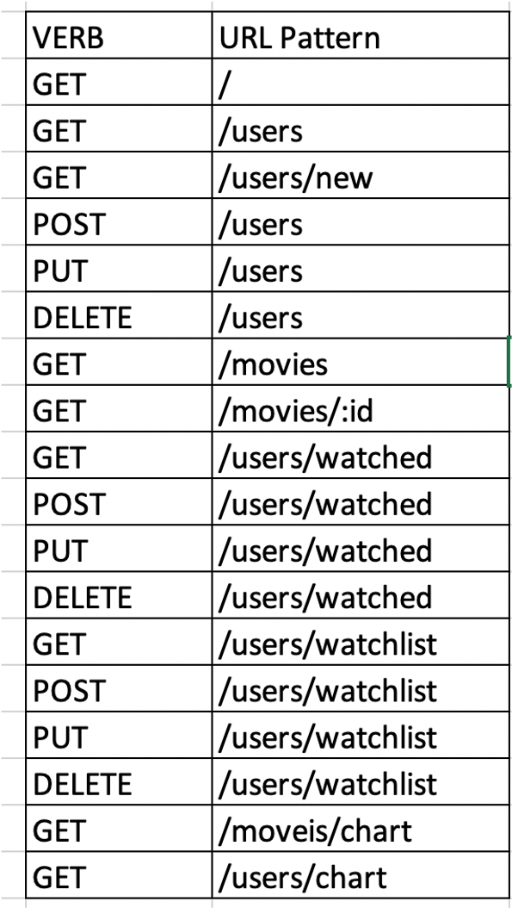
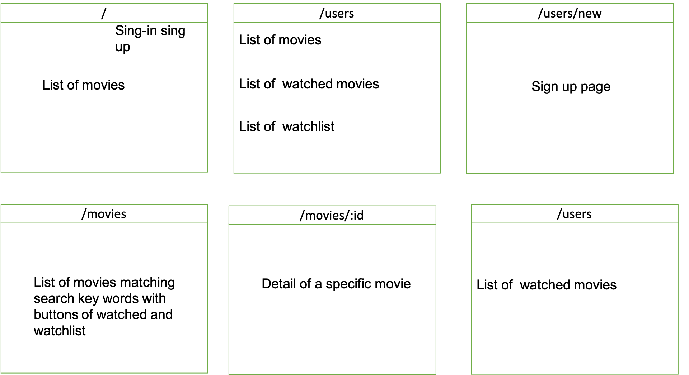
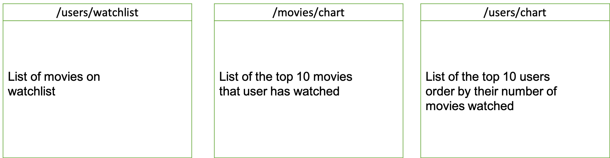

# Movie Tracker

## Project idea and description

We all have seen many movies and sometimes we don't remember whether we have seen them before. Therefore a movie tracker app will come handy. You can not only mark the movie that you have seen but also add movies to a watchlist so that you will remember to watch them. You can see the top 10 movies by view times and top 10 movie viewers by the number of movies they have seen.

## Choice of API

OMDb API (https://www.omdbapi.com/)

## ERDs

## Restful Routing Chart

## Wireframe

## User Stories
- Search any movies and check their detail
- Mark movies as watched if they have seen the movie
- Add movies to the watchlist if they have seen the movie
- Check Top 10 popular movies
- Check Top 10 movie viewers

## MVP Goals
- Create 3 models with correction relationship
- Set up the routes to render correct ejs files
- Set up ejs files presenting proper information
- Add CSS style to the ejs files
- Set up Auth to make the website safe

## Stretch Goals
- Make the Webpage look professional
- Add a comment model
- Modify the ejs files to incorporate comments