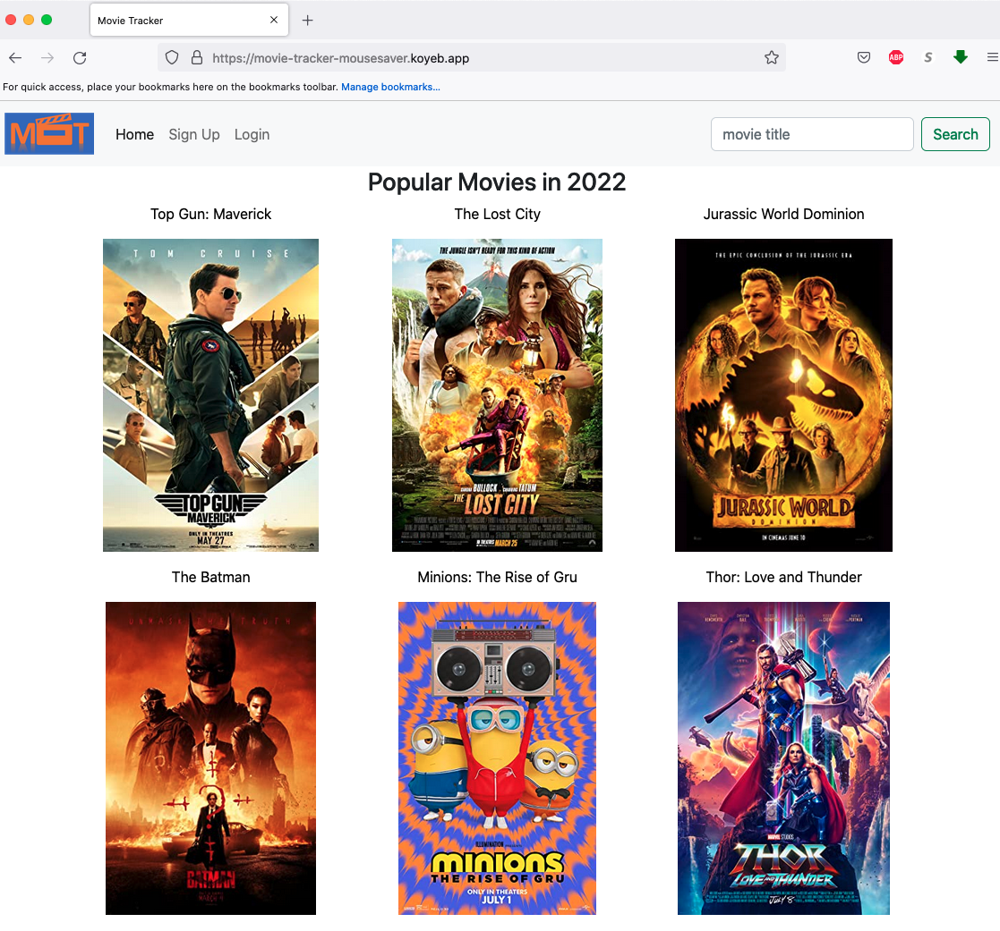

# Movie Tracker

## Project idea and description

We all have seen many movies and sometimes we don't remember whether we have seen them before. Therefore a movie tracker app will come handy. You can not only mark the movie that you have seen but also add movies to a watchlist so that you will remember to watch them. You can also comment on movies and see other people's comments too.

## App Link
https://movie-tracker-mousesaver.koyeb.app/

## Choice of API

OMDb API (https://www.omdbapi.com/)

## Tech Being Used
- HTML
- CSS/Bootstrap
- JavaScript
- Node
- Express
- API
- Sequalize

## ERDs

## Restful Routing Chart

## Wireframe

## User Stories
- Sign up for an personal account to track their movies and comments
- Search any movies and check their detail
- Mark movies as watched if they have seen the movie
- Read other people's comments on movies
- Comment on movies if they have some thoughts
- Add movies to the watchlist if they want to see them
- Edit or delete their accounts
- Edit or delete their comments

## MVP Goals
- Create 3 models with correction relationship ✅
- Set up the routes to render correct ejs files ✅
- Set up ejs files presenting proper information ✅
- Add CSS style to the ejs files ✅
- Set up Auth to make the website safe ✅

## Stretch Goals
- Make the Webpage look professional ✅
- Add a comment model ✅
- Modify the ejs files to incorporate comments ✅

## Source Used
The "poster unavailable" image is from https://www.csaff.org/wp-content/uploads/csaff-no-poster.jpg