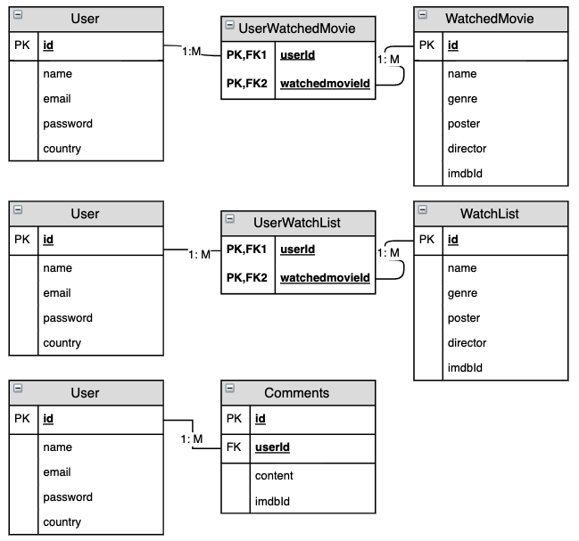
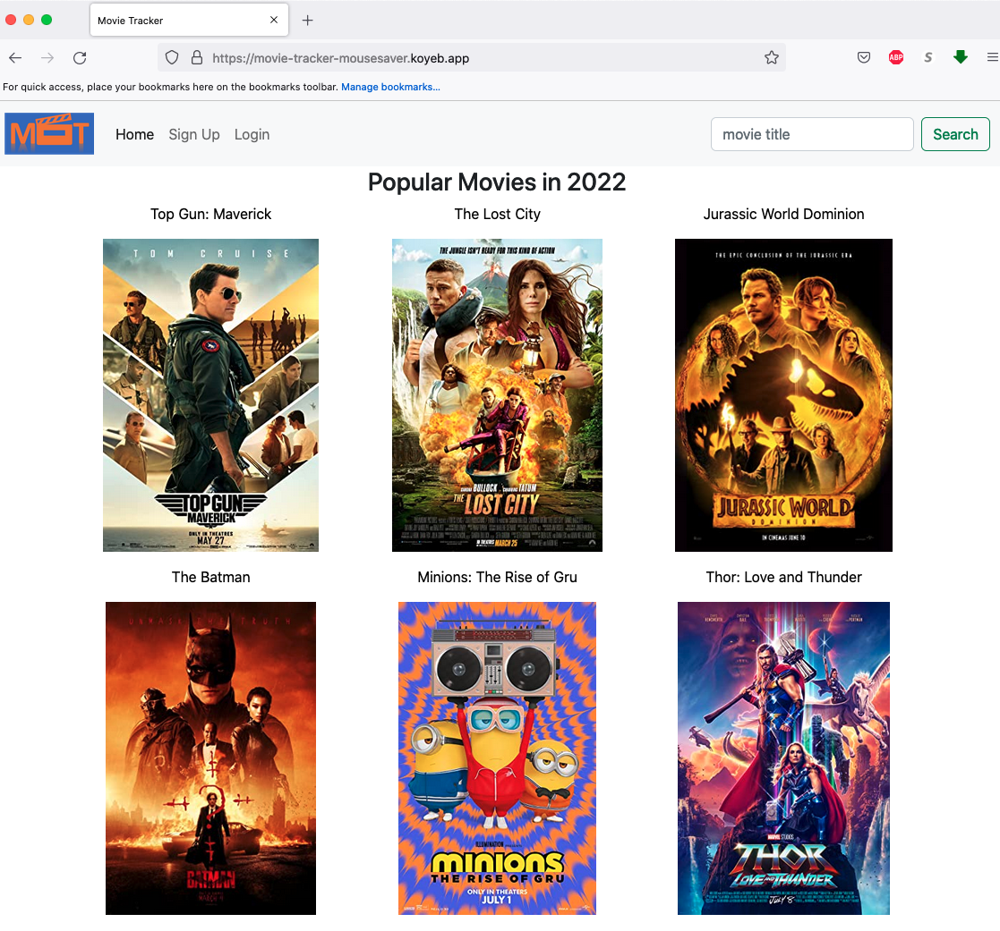
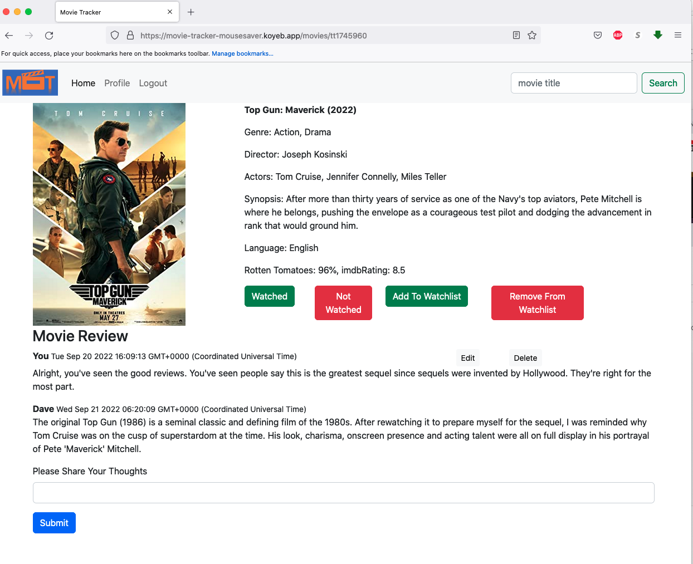
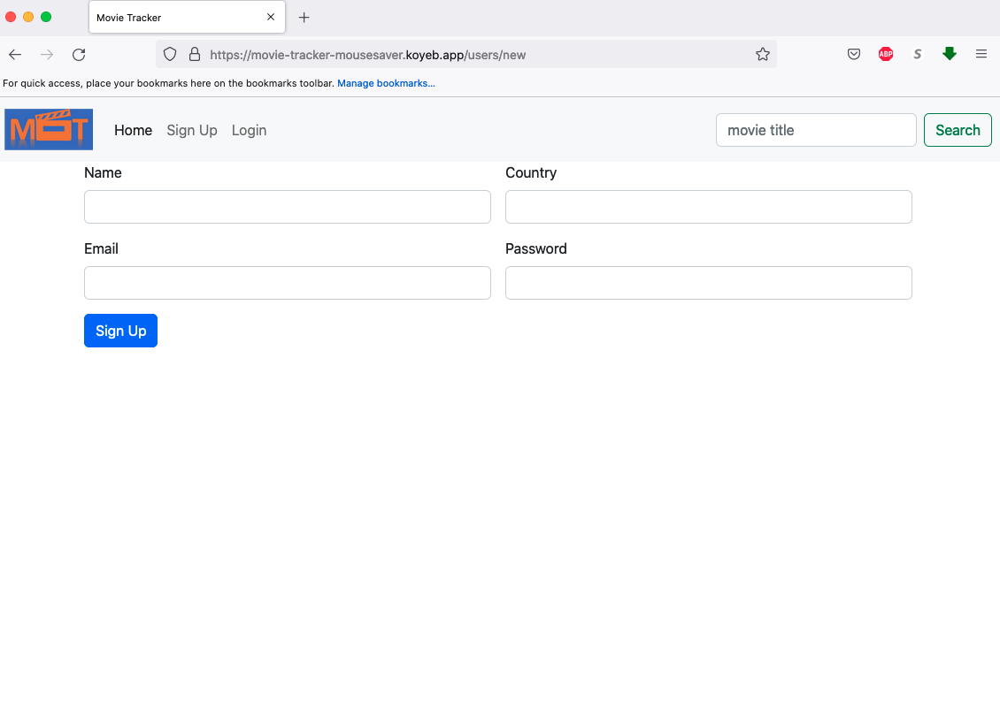
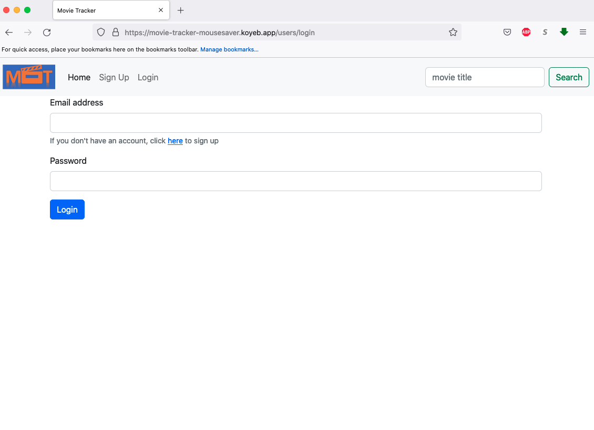
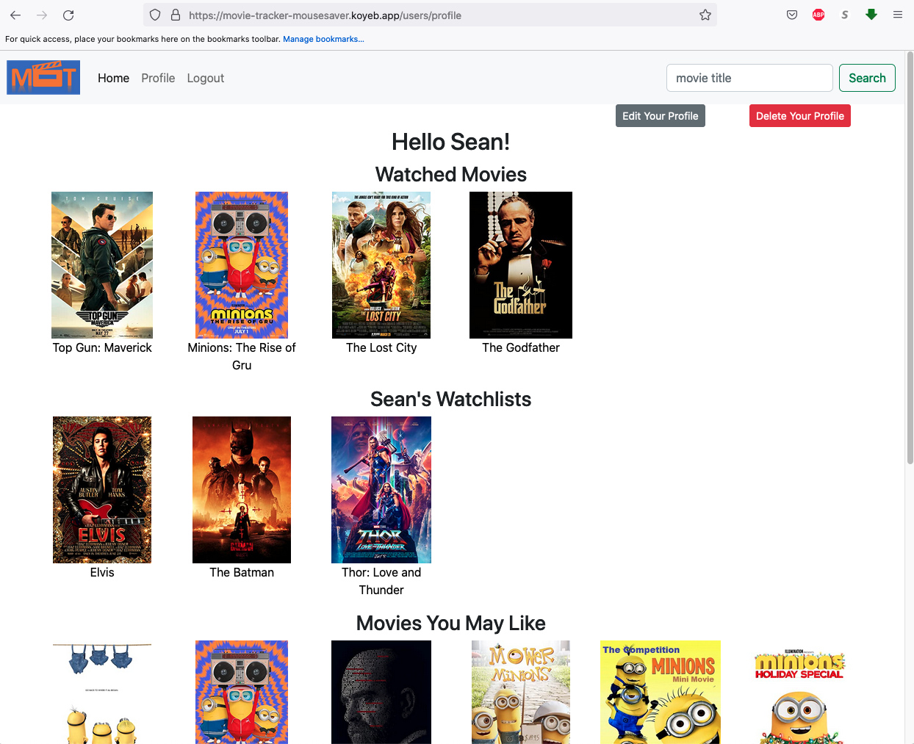

# Movie Tracker

## Project idea and description

We all have seen many movies and sometimes we don't remember whether we have seen them before. Therefore a movie tracker app will come handy. You can not only mark the movie that you have seen but also add movies to a watchlist so that you will remember to watch them. You can also comment on movies and see other people's comments too.

## App Link
https://movie-tracker-mousesaver.koyeb.app/

## Choice of API

OMDb API (https://www.omdbapi.com/)

## Tech Being Used
- HTML
- CSS/Bootstrap
- JavaScript
- Node
- Express
- API
- Sequalize

## Installation Instruction
* Fork and clone this repository to your local directory
* Navigate to the directory in your terminal and run ` npm i ` to install dependencies
* Run `touch .env `and type in the following code in the .env file:
``` ENC_SECRET='secret' ```
``` API_KEY=******* ``` 
* Replace 'secret' with any string you like if necessary
* Go to https://www.omdbapi.com/apikey.aspx to generate an API key and replace the above *** with your API key.
* Setup your database (this app has four existing models)
  * Run `createdb movie_tracker` to create the database
  * Run `sequelize db:migrate` to run migrations
* Use `npx nodemon` (or just `nodemon` if you installed it globally) to start your application
* Go to http://localhost:8080/ in any browser to track your movies

## ERDs


## Restful Routing Chart
### User Routes
| Method | Path | Purpose |
| ------ | -------------- | -------------------------------- |
| GET | `/` | home page that lists popular movies in 2022|
| GET | `/users/login` | user login page |
| POST | `/users/login` | accept a payload of form data and use it log a user in, then redirects back to `GET /users/profile` |
| POST | `/users` | creates a new user, then redirects to `GET /users/profile` |
| GET | `/users/new` | page that has a form for creating a new user |
| GET | `/users/logout` | log out a user by clearing the stored cookie |
| GET | `/users/profile` | user profile page |
| GET | `/users/profile/edit` | user profile edit page |
| PUT | `/` | update user;s profile, then redirect to `GET /users/profile`|
| DELETE | `/users/profile` | delete user profile page, then redirect to `GET /` |
| POST | `/users/watched` | mark one movie as watched, then redirects to `GET /movies/$:movie_id` |
| POST | `/users/watched/undo` | mark one movie as unwatched, then redirects to `GET /movies/$:movie_id` |
| POST | `/users/watchlist` | add one movie to a watchlist, then redirects to `GET /movies/$:movie_id` |
| POST | `/users/watched/undo` | remove one movie from a watchlist, then redirects to `GET /movies/:movie_id` |

### Movie Routes
| Method | Path | Purpose |
| ------ | -------------- | -------------------------------- |
| GET | `/movies/` | show movie search results|
| GET | `/movies/:movie_id` | show a specific movie with details|

### Comment Routes
| Method | Path | Purpose |
| ------ | -------------- | -------------------------------- |
| POST | `/comments/` | add a comment to a specific movie, then redirects to `GET /movies/:movie_id`|
| DELETE | `/comments/:movie_id` | delete a specific comment, then redirects to `GET /movies/:movie_id`|
| GET | `/comments/edit/:movie_id` | show a form for editing a comment|
| PUT | `/comments/` | update a comment, then redirects to `GET /movies/:movie_id`|


## Wireframe
Home Page

Movie Detail Page

User Signup Page

User Login Page

User Profile Page


## User Stories
- Sign up for an personal account to track their movies and comments
- Search any movies and check their detail
- Mark movies as watched if they have seen the movie
- Read other people's comments on movies
- Comment on movies if they have some thoughts
- Add movies to the watchlist if they want to see them
- Edit or delete their accounts
- Edit or delete their comments

## MVP Goals
- Create 3 models with correction relationship ✅
- Set up the routes to render correct ejs files ✅
- Set up ejs files presenting proper information ✅
- Add CSS style to the ejs files ✅
- Set up Auth to make the website safe ✅

## Stretch Goals
- Make the Webpage look professional ✅
- Add a comment model ✅
- Modify the ejs files to incorporate comments ✅

## Source Used
The "poster unavailable" image is from https://www.csaff.org/wp-content/uploads/csaff-no-poster.jpg